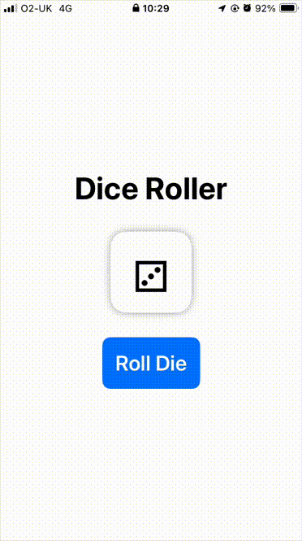

# iOS Dice Roller App

A simple SwiftUI-based dice rolling app featuring animated 3D dice rolls with Unicode dice face emojis (⚀⚁⚂⚃⚄⚅).

## Requirements

- iOS 15.0+
- Xcode 13.0+
- Swift 5.5+

## Installation

1. Clone the repository
2. Open `DiceRoller.xcodeproj` in Xcode
3. Build and run

## Usage

Tap the "Roll Die" button or shake your device to roll the die. The die will animate and display a random face.

## Code Structure

- `DieModel.swift`: Core die logic
- `DieView.swift`: Die face UI component
- `ContentView.swift`: Main app interface
- `DiceRollerApp.swift`: App entry point

## License

MIT License - Feel free to use and modify

## Credits

Created as a SwiftUI learning project. Dice face emojis courtesy of Unicode Standard 🎲
